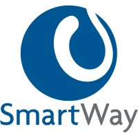

# Smartway - Práctica Final

---

## Enunciado de la práctica

### Historia de la misión

La red de comunicaciones internas de **CyberPulse Labs** se ha fragmentado tras una serie de ciberataques coordinados. Cada equipo de analistas opera con herramientas distintas y registros desorganizados.  
Tu misión como **agente desarrollador** es construir un sistema unificado de gestión de operaciones, accesible desde una interfaz moderna y conectada a una base de datos persistente.

### Objetivo de la aplicación

- Una interfaz en **Vue 3** usando **Tailwind CSS** y **DaisyUI**.  
- Una **API REST** con **ASP.NET Core** y **Entity Framework**, conectada a una base de datos.

### Modelos y relaciones

Deberás modelar al menos tres entidades con relaciones entre ellas. Una propuesta de ejemplo:

- **Operaciones**: `id`, `nombre`, `estado` (planificada, activa, completada), `fechaInicio`, `fechaFin`.  
- **Equipos**: `id`, `nombre`, `especialidad`, `operacionId` (relación con Operaciones).  
- **Agentes**: `id`, `nombre`, `rango`, `activo` (boolean), `equipoId` (relación con Equipos).  

Estas relaciones permitirán practicar asociaciones **uno-a-muchos**, navegación de datos y operaciones **CRUD** anidadas.

### Funcionalidades mínimas

- CRUD completo de cada entidad (crear, listar, editar, eliminar).  
- Conexión de frontend y backend mediante `fetch` o **axios**.  
- Navegación con barra lateral o superior para cambiar entre secciones.  
- Diseño responsivo y estilizado con **Tailwind + DaisyUI**.  
- Validación básica de formularios.  
- Manejadores de error y carga.

### Recomendaciones técnicas

- Organiza el frontend en componentes **Vue** reutilizables.  
- Usa `reactive()` o `ref()` para gestionar el estado local.  
- Integra **Pinia** como sistema de gestión de estado para centralizar y compartir datos entre componentes:  
  - Crea un **store** para gestionar el estado global de operaciones, equipos y agentes.  
  - Usa **acciones** para manejar llamadas a la API y **mutaciones** para actualizar el estado.  
- Usa rutas (**Vue Router**) si es posible, o *tabs* si prefieres mantenerlo simple.  
- Implementa controladores separados para cada entidad en el backend.  
- Utiliza **migraciones** con Entity Framework para construir y actualizar la base de datos.

---

> **CyberPulse Labs** necesita estabilidad, organización y una interfaz digna de una red de élite.  
> ¡El futuro de la operación depende de tu código!
